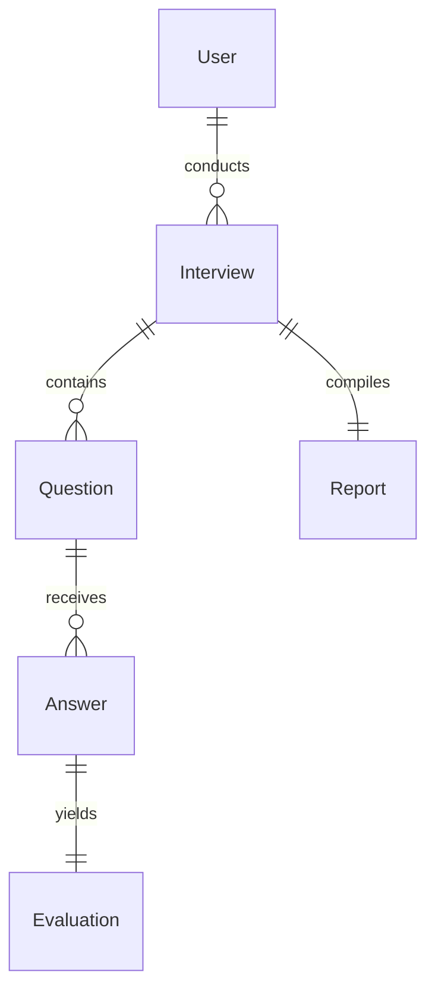
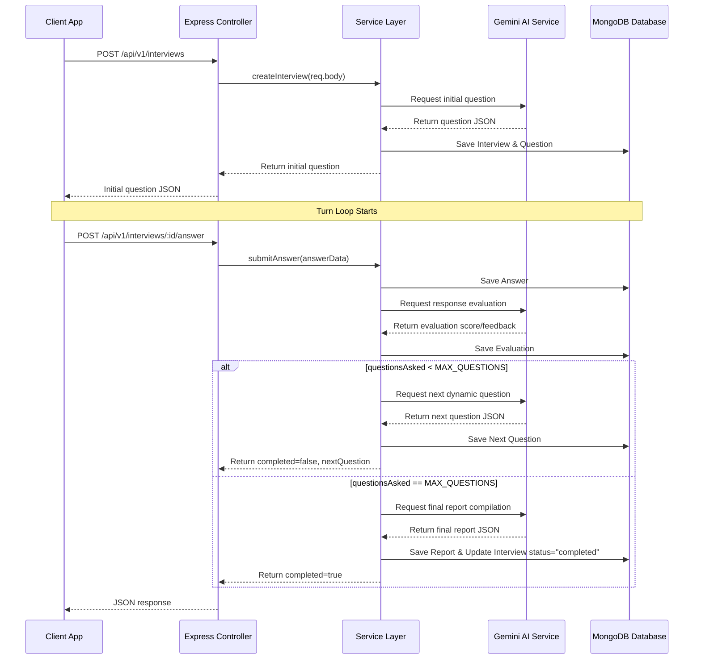

# 🎙️ InterviewIQ Backend Architecture & Database Documentation

This document provides a comprehensive technical overview of the InterviewIQ backend engine. It describes the directory structure, modular design patterns, database schemas, operational loops, and Google Gemini AI model integrations.

---

## 📂 Backend File Architecture
The backend is built with a structured, modular design pattern in **Node.js, Express, TypeScript, and MongoDB (via Mongoose)**.

```
server/
├── src/
│   ├── ai/                      # AI Core Prompting and Engines
│   │   ├── prompts/             # Gemini Prompt Templates
│   │   └── services/            # Gemini and Evaluation SDK wrappers
│   ├── config/                  # Configuration Layer (env, db connection, logger)
│   ├── modules/                 # Modular Domain Layers
│   │   ├── auth/                # Sign-in/Sign-up Controllers & Services
│   │   ├── dashboard/           # Metrics compilation & repository logic
│   │   ├── interview/           # Question cycles & session controllers
│   │   ├── question/            # DB models for interview questions
│   │   ├── answer/              # DB models for user voice transcripts
│   │   ├── evaluation/          # Dynamic responses analysis and grading
│   │   └── report/              # Synthesized final summaries
│   ├── shared/                  # Common Helpers & Middlewares
│   │   ├── middleware/          # JWT auth validation, Zod request filters
│   │   └── utils/               # Safe handlers, errors mappings
│   ├── app.ts                   # Express application setup
│   └── server.ts                # HTTP Server bootstrapping & DB trigger
└── tsconfig.json                # TypeScript Configurations
```

---

## 🗄️ Database Architecture & Schemas
Mongoose indexes, types, and model schemas are structured modularly to decouple active session loops from final report assessments.



### 1. User Schema (`User`)
Stores account credentials.
- `name` *(String, required)*: Candidate's full name.
- `email` *(String, required, unique)*: Lowercase-transformed unique email index.
- `password` *(String, required)*: Hashed password string.

### 2. Interview Schema (`Interview`)
Represents a mock interview configuration and track status.
- `userId` *(ObjectId, ref "User", index)*: Reference to the conducting candidate.
- `role` *(String, required)*: Job title / role target (e.g. "React Engineer").
- `type` *(String, enum ["Technical", "behavioral"])*: Focus domain of the interview.
- `difficulty` *(String, enum ["easy", "medium", "hard"])*: Base complexity modifier.
- `techStacks` *(String)*: Comma-separated list of target technologies (e.g. "React, Node.js").
- `status` *(String, enum ["pending", "in_progress", "completed"])*: Lifecycle state tracker.
- `questionsAsked` *(Number)*: Incremental counter of the current interview progress.
- `startedAt` / `endedAt` *(Date)*: Duration tracker variables.

### 3. Question Schema (`Question`)
Keeps track of all AI-generated questions assigned to an interview.
- `interviewId` *(ObjectId, ref "Interview", index)*: Direct parent session.
- `question` *(String, required)*: The actual question prompt.
- `topic` *(String, required)*: Domain (e.g., "Closure", "State Management").
- `difficulty` *(String, enum ["easy", "medium", "hard"])*: Question difficulty.
- `order` *(Number, required)*: Sequential place in the session.
- `isFollowUp` *(Boolean)*: Tracks if this was generated as a dynamic follow-up to a previous answer.

### 4. Answer Schema (`Answer`)
Stores candidate voice answers.
- `interviewId` *(ObjectId, ref "Interview", index)*: Context reference.
- `questionId` *(ObjectId, ref "Question")*: Question reference.
- `answer` *(String, required)*: Spoken text response transcribed by the client.
- `responseTime` *(Number, required)*: Seconds elapsed while answering.

### 5. Evaluation Schema (`Evaluation`)
Calculated inline evaluations for an individual answer.
- `answerId` *(ObjectId, ref "Answer", unique)*: Direct reference to evaluated answer.
- `interviewId` *(ObjectId, ref "Interview", index)*: Context reference.
- `technicalAccuracy` *(Number, 0-10)*: Score rating technical correctness.
- `communication` *(Number, 0-10)*: Score rating structure and style.
- `reasoning` *(Number, 0-10)*: Score rating approach and logic.
- `overallScore` *(Number, 0-10)*: Arithmetic evaluation aggregate.
- `feedback` *(String, required)*: Technical critique and explanations.
- `weakTopics` *(Array of Strings)*: Topic domains that the candidate struggled with.

### 6. Report Schema (`Report`)
Synthesizes the overall performance statistics once the session concludes.
- `interviewId` *(ObjectId, ref "Interview", unique, index)*: Context reference.
- `overallScore` / `technicalScore` / `communicationScore` / `reasoningScore` *(Number, 0-10)*: Final aggregated metrics.
- `strengths` *(Array of Strings)*: Key areas of strong performance.
- `improvements` *(Array of Strings)*: Critical fields to revise.
- `summary` *(String, required)*: Overall descriptive summary compiled by Gemini.

---

## 🔄 Core Backend Operational Flow



### 1. Creation Flow (`POST /interviews`)
- **Controller**: Receives role, company, difficulty, focus type.
- **Service Layer**:
  1. Creates an `Interview` record (with `questionsAsked` initialized to `0`).
  2. Submits a structured prompt containing instructions, candidate focus, and difficulty targets to `gemini.service`.
  3. Receives the initial question JSON.
  4. Stores the first `Question` record (marked as order `1`), and returns the context to the client.

### 2. Turn Submission & Logic Loop (`POST /interviews/:id/answer`)
Each turn submits the question ID, candidate transcript text, and response time.
- **Service Layer**:
  1. Stores the candidate's transcript as an `Answer` record.
  2. Calls `evaluateAnswer()` using a specialized evaluation prompt template.
  3. Receives and stores the `Evaluation` record (scores out of 10, criteria metrics, weak topics).
  4. Evaluates the session status: compares the current completed answers counter (`questionsAsked`) against `MAX_QUESTIONS` (default: 10):
     - **If under limit**: Triggers `generateQuestion()` with the session history, the weak topics noted, `techStacks`, and instructions to format a sequential follow-up question. Stores the new `Question` record and returns it to the client with `completed: false`.
     - **If limit reached**: Fetches all questions, answers, and evaluations for this interview. Compiles them into a report prompt for Gemini. Gemini returns a performance review structure. Stores the `Report` document, sets the interview status to `"completed"`, and returns `completed: true`.

---

## 🤖 Gemini AI Prompting Engine
Located in `src/ai/services/gemini.service.ts` and `src/ai/prompts/interview.prompt.ts`.

### 1. AI Engine Config
- Uses the **`gemini-2.5-pro`** model via the official `@google/genai` SDK.
- Enforces strict JSON response outputs (`responseMimeType: "application/json"` combined with strict Zod interfaces defined in the prompts).

### 2. Prompt Formulations
The system utilizes three distinct prompts:
1. **Initial Question Prompt**: Generates a standard introduction question tailored to the specified job role, target company, and difficulty parameters.
2. **Turn Evaluation Prompt**: Takes the active question and user transcript to calculate technical accuracy, logical reasoning structure, and communication clarity. Returns evaluation metadata, scores, and an array of weak topic tags.
3. **Report Compilation Prompt**: Synthesizes the overall interview transcript, response times, and step evaluations to compile a high-level summary, strengths checklist, and improvement instructions.
